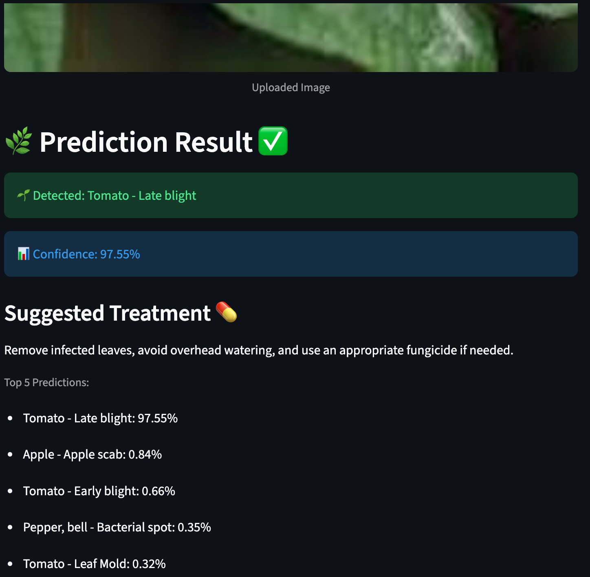

# 🌿 Plant Disease Detection (PlantVillage)

A simple end-to-end Computer Vision project that detects plant leaf diseases from images using a trained TensorFlow model and a Streamlit web app.

## ✅ Features
- Upload a leaf image (JPG/PNG)
- Predict disease class + confidence score
- Show Top-5 predictions
- Display suggested treatment (basic rule-based info)

## 🧠 Model
- Trained on PlantVillage dataset (multiple crops and diseases)
- Transfer Learning model (saved as `model.keras`)

## 🚀 Run Locally

### 1) Create & activate virtual environment
```markdown
## 🚀 Run Locally

### 1) Create & activate virtual environment
python3 -m venv .venv
source .venv/bin/activate


## 📸 App Screenshots

### Upload Page


### Prediction Result
 